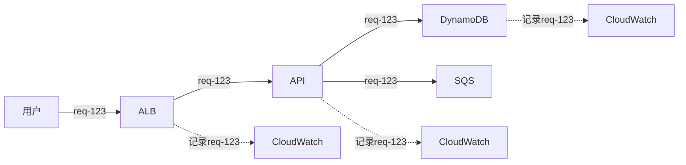

# 阶段1：本地开发环境 - 学习总结

> **完成时间**: 2026-02-02  
> **状态**: ✅ 已完成  
> **投入时间**: 约2小时  

---

## 📋 本阶段目标

快速搭建可运行的Python FastAPI服务，理解Web服务基本原理和SRE核心概念。

---

## 📁 创建的文件

```
app/
├── quotes.py          # 毛主席语录数据库
├── main.py           # FastAPI应用主文件
└── requirements.txt  # Python依赖清单
```

---

## 🎯 核心知识点

### 1. Python模块设计

**要点**：
- 单一职责原则：每个模块只做一件事
- 可测试性：使用 `if __name__ == "__main__"` 独立测试
- 函数设计：参数清晰、返回值明确

**代码示例**：
```python
# quotes.py - 职责清晰的模块
def get_random_quote() -> str:
    """单一职责：只负责随机获取"""
    return random.choice(MAO_QUOTES)

def get_quote_by_keyword(message: str) -> str:
    """单一职责：只负责关键词匹配"""
    # 逻辑实现...
```

**面试考点**：
- Q: 为什么要模块化设计？
- A: 易于测试、易于维护、易于复用、降低耦合

---

### 2. 数据结构选择

**当前选择**: Python list
```python
MAO_QUOTES = ["语录1", "语录2", ...]  # 简单、快速
```

**何时升级**？

| 数据量 | 更新频率 | 持久化需求 | 推荐方案 |
|--------|---------|-----------|---------|
| < 100条 | 静态 | 不需要 | ✅ List（当前） |
| > 1000条 | 动态 | 需要 | DynamoDB |
| 高频访问 | 任意 | 需要缓存 | ElastiCache/Redis |
| 多实例共享 | 任意 | 需要 | 数据库 + 缓存 |

**面试考点**：
- Q: 什么时候应该从内存数据迁移到数据库？
- A: 数据量大、需要持久化、需要多实例共享、需要复杂查询

---

### 3. 依赖管理

**版本控制策略**：
```
fastapi==0.109.0      # 完全锁定（推荐生产环境）
fastapi>=0.109.0      # 最低版本（危险）
fastapi~=0.109.0      # 允许补丁更新（平衡选择）
```

**SemVer语义化版本**：
- `X.0.0` - 主版本：破坏性变更
- `0.X.0` - 次版本：新特性，向后兼容
- `0.0.X` - 补丁版本：Bug修复

**最佳实践**：
1. ✅ 锁定版本号
2. ✅ 使用虚拟环境
3. ✅ 定期安全扫描（`safety check`）
4. ✅ 渐进式升级策略

**面试考点**：
- Q: 如何避免依赖冲突？
- A: 虚拟环境隔离、Docker容器、版本锁定、定期更新测试

---

### 4. FastAPI框架

**为什么选FastAPI？**

| 特性 | FastAPI | Flask | Django |
|------|---------|-------|--------|
| 异步支持 | ✅ 原生 | ❌ 需要扩展 | ⚠️ 部分支持 |
| 自动文档 | ✅ Swagger/ReDoc | ❌ | ⚠️ 需要扩展 |
| 类型提示 | ✅ 强制 | ❌ | ⚠️ 可选 |
| 性能 | ⭐⭐⭐⭐⭐ | ⭐⭐⭐ | ⭐⭐⭐ |
| 适用场景 | 微服务API | 小型应用 | 大型Web应用 |

**核心概念**：
```python
# 1. 路径操作装饰器
@app.get("/")          # GET请求
@app.post("/chat")     # POST请求

# 2. 依赖注入
async def get_db():
    # 数据库连接
    pass

# 3. Pydantic数据验证
class ChatRequest(BaseModel):
    message: str  # 自动验证类型
```

**面试考点**：
- Q: 什么是异步编程？为什么重要？
- A: 单线程处理多个并发请求，提高IO密集型任务性能。关键场景：高并发API、调用外部服务

---

### 5. 健康检查（Health Checks）⭐⭐⭐

**两种类型**：

#### Liveness Probe（存活探针）
```python
@app.get("/health")
async def health_check():
    # 检查：进程是否活着？
    return {"status": "healthy"}
```

**用途**: Kubernetes判断容器是否需要重启  
**检查内容**: 
- ✅ 进程基本功能
- ❌ 不检查外部依赖（数据库等）

#### Readiness Probe（就绪探针）
```python
@app.get("/ready")
async def readiness_check():
    # 检查：是否准备好接收流量？
    if get_total_quotes() == 0:
        raise HTTPException(503)
    return {"status": "ready"}
```

**用途**: Kubernetes判断是否应该转发流量  
**检查内容**:
- ✅ 外部依赖（数据库、缓存）
- ✅ 数据加载完成
- ✅ 配置正确加载

**关键区别**：

| 场景 | Liveness | Readiness | K8s行为 |
|------|----------|-----------|---------|
| 进程卡死 | ❌ FAIL | ❌ FAIL | 重启Pod |
| 数据库断开 | ✅ OK | ❌ FAIL | 暂停流量，不重启 |
| 启动中加载数据 | ✅ OK | ❌ FAIL | 等待就绪 |

**真实案例**：
> 服务启动需要30秒加载1GB数据
> - 只有health：K8s认为启动失败，反复重启 ❌
> - health + ready：等待ready后再转发流量 ✅

**面试考点**：
- Q: Liveness和Readiness的区别？
- A: Liveness检查进程是否活着（失败→重启），Readiness检查是否准备好接收流量（失败→暂停流量）

---

### 6. 中间件（Middleware）

**定义**: 在请求到达endpoint之前/之后执行的代码

```python
@app.middleware("http")
async def log_requests(request: Request, call_next):
    # 请求前
    start = time.time()
    
    # 调用实际处理函数
    response = await call_next(request)
    
    # 请求后
    duration = time.time() - start
    logger.info(f"Duration: {duration:.3f}s")
    
    return response
```

**常见用途**：

| 用途 | 不用中间件 | 用中间件 |
|------|-----------|---------|
| 日志记录 | 每个endpoint重复代码 | ✅ 一次编写全局生效 |
| 认证鉴权 | 分散在各处 | ✅ 统一检查 |
| 限流 | 难以统一 | ✅ 全局限流 |
| CORS | 手动设置 | ✅ 自动处理 |

**生产环境示例**：
```python
# 认证中间件
if not verify_token(request.headers.get("Authorization")):
    raise HTTPException(401)

# 限流中间件
if rate_limiter.exceeded(get_client_ip(request)):
    raise HTTPException(429)
```

**面试考点**：
- Q: 什么场景应该使用中间件？
- A: 需要在所有请求前/后执行的通用逻辑（日志、认证、限流、CORS等）

---

### 7. 请求追踪（Request Tracing）⭐⭐⭐

**核心概念**: 为每个请求分配唯一ID

```python
request_id = f"req-{int(time.time() * 1000)}-{request_count}"
response.headers["X-Request-ID"] = request_id
```

**为什么重要？**

**没有Request ID的场景**：
```
用户："我10:30的请求失败了"
SRE："10:30有10000条日志，不知道是哪个 😰"
```

**有Request ID的场景**：
```
用户："req-1770076559742 这个请求失败了"
SRE："找到了！追踪到完整链路 😎"
```

**分布式追踪**：


**生产环境最佳实践**：
1. 生成全局唯一的Trace ID
2. 在HTTP Header中传递（`X-Trace-ID`）
3. 所有日志都记录Trace ID
4. 使用OpenTelemetry标准
5. 集成日志聚合系统（CloudWatch Logs Insights）

**面试考点**：
- Q: 如何在微服务架构中追踪一个请求？
- A: 生成唯一Trace ID，在所有服务间传递，统一记录到日志，使用日志聚合工具查询

---

### 8. 优雅关闭（Graceful Shutdown）

**定义**: 服务关闭时正确清理资源，不丢失数据

```python
@app.on_event("shutdown")
async def shutdown_event():
    # 1. 停止接收新请求
    # 2. 等待现有请求完成
    # 3. 关闭数据库连接
    # 4. 清理资源
    logger.info("服务正在关闭...")
```

**为什么重要？**

**不优雅关闭**：
```
K8s: 关闭Pod！
Pod: 立即退出
用户请求: ❌ 连接断开
数据库: ❌ 连接未关闭（可能导致连接泄露）
```

**优雅关闭**：
```
K8s: 发送SIGTERM信号
Pod: 停止接收新请求
Pod: 等待现有请求完成（最多30秒）
Pod: 关闭数据库连接
Pod: ✅ 可以关闭了
```

**Kubernetes配置**：
```yaml
spec:
  terminationGracePeriodSeconds: 30  # 给30秒优雅关闭时间
```

**面试考点**：
- Q: 什么是优雅关闭？为什么重要？
- A: 服务关闭时正确清理资源、完成现有请求，避免数据丢失和请求失败

---

### 9. 监控指标（Metrics）

**Google SRE四大黄金信号**：

1. **Latency（延迟）**
   - P50（中位数）：50%的请求延迟
   - P95：95%的请求延迟
   - P99：99%的请求延迟

2. **Traffic（流量）**
   - QPS（每秒查询数）
   - RPS（每秒请求数）

3. **Errors（错误）**
   - 错误率 = 失败请求 / 总请求
   - 错误类型分布（4xx vs 5xx）

4. **Saturation（饱和度）**
   - CPU使用率
   - 内存使用率
   - 队列长度

**当前实现 vs 生产环境**：

| 指标 | 当前 | 生产环境（Prometheus） |
|------|------|---------------------|
| 请求数 | ✅ `request_count` | `http_requests_total` |
| 运行时间 | ✅ `uptime_seconds` | `process_uptime_seconds` |
| 延迟 | ❌ | `http_request_duration_seconds` |
| 错误率 | ❌ | `http_requests_failed_total` |

**面试考点**：
- Q: Google SRE四大黄金信号是什么？
- A: 延迟（Latency）、流量（Traffic）、错误（Errors）、饱和度（Saturation）

---

### 10. 结构化日志

**定义**: 使用结构化格式（如JSON）记录日志

**当前实现**：
```python
logging.basicConfig(
    format='%(asctime)s - %(name)s - %(levelname)s - %(message)s'
)
```

**生产环境**：
```python
# JSON格式日志
{
  "time": "2026-02-02T10:30:00",
  "level": "INFO",
  "request_id": "req-123",
  "user_id": "user456",
  "message": "Request completed",
  "duration_ms": 45.2
}
```

**为什么重要？**
- ✅ 易于解析（日志聚合系统）
- ✅ 易于查询（CloudWatch Logs Insights）
- ✅ 易于分析（统计、告警）

**面试考点**：
- Q: 为什么要使用结构化日志？
- A: 易于机器解析和查询，便于日志聚合和分析

---

## 🔧 实际操作

### 创建的三个文件

#### 1. `quotes.py` - 数据层
```python
# 核心函数
get_random_quote()           # 随机获取
get_quote_by_keyword(msg)    # 关键词匹配
get_total_quotes()           # 获取总数
```

#### 2. `requirements.txt` - 依赖管理
```
fastapi==0.109.0      # Web框架
uvicorn==0.27.0       # ASGI服务器
pydantic==2.5.3       # 数据验证
boto3==1.34.23        # AWS SDK（Phase 4用）
```

#### 3. `main.py` - 应用层
```python
# 核心端点
GET  /              # 服务信息
GET  /health        # Liveness Probe
GET  /ready         # Readiness Probe
GET  /metrics       # 监控指标
POST /chat          # 核心业务
GET  /quotes/random # 随机语录
```

---

## 🧪 测试结果

```bash
# 测试1：健康检查
curl http://localhost:8000/health
# ✅ {"status": "healthy", "quotes_count": 30}

# 测试2：就绪检查
curl http://localhost:8000/ready
# ✅ {"status": "ready"}

# 测试3：监控指标
curl http://localhost:8000/metrics
# ✅ {"request_count": 4, "uptime_seconds": 29.13}

# 测试4：核心功能
curl -X POST http://localhost:8000/chat \
  -H "Content-Type: application/json" \
  -d '{"message": "今天好累啊"}'
# ✅ {"quote": "自力更生，艰苦奋斗", ...}
```

---

## 📚 扩展阅读

### 官方文档
- [FastAPI官方文档](https://fastapi.tiangolo.com/)
- [Pydantic文档](https://docs.pydantic.dev/)
- [Uvicorn文档](https://www.uvicorn.org/)

### SRE相关
- [Google SRE Book](https://sre.google/books/)
- [Kubernetes健康检查](https://kubernetes.io/docs/tasks/configure-pod-container/configure-liveness-readiness-startup-probes/)
- [OpenTelemetry](https://opentelemetry.io/)

---

## 🎯 面试准备清单

### 基础概念
- [ ] 能解释FastAPI vs Flask的区别
- [ ] 理解异步编程的原理
- [ ] 知道Pydantic的作用

### SRE核心
- [ ] 能解释Liveness vs Readiness
- [ ] 理解为什么需要Request ID
- [ ] 知道什么是优雅关闭
- [ ] 能说出四大黄金信号

### 实战经验
- [ ] 能描述如何排查API延迟问题
- [ ] 知道如何设计健康检查
- [ ] 理解中间件的使用场景

---

## 💡 关键收获

1. **SRE思维**：从第一行代码就考虑可观测性、可靠性
2. **最佳实践**：健康检查、日志记录、优雅关闭
3. **面向未来**：代码简单但预留扩展空间
4. **理论结合实践**：不仅知道概念，还能动手实现

---

## 📝 下一步

阶段2会学习：
- Docker容器化
- 多阶段构建
- docker-compose编排
- 容器安全最佳实践

**继续加油！** 🚀
